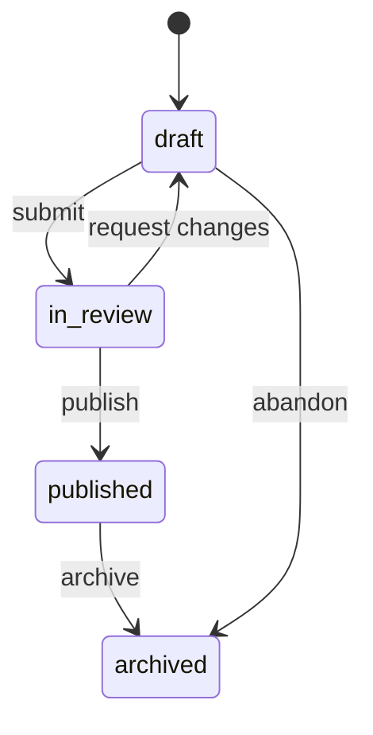
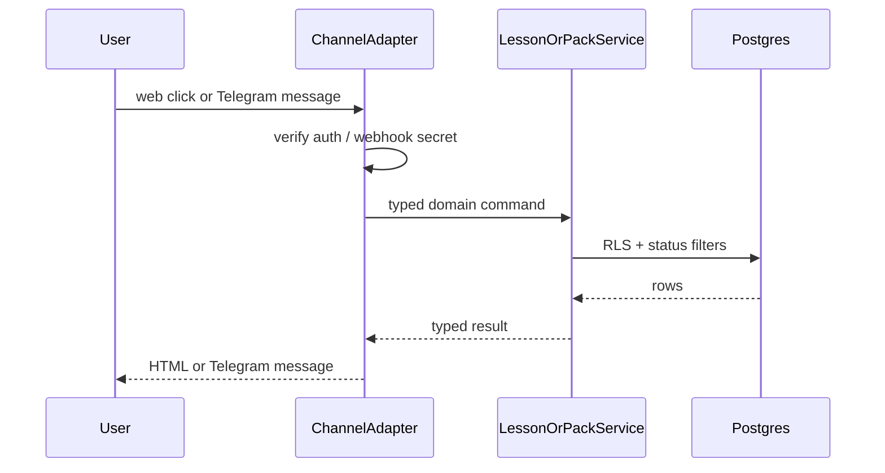

# Request for Comments (RFC) / Tech Spec

**Title:** Channel adapter interface and content-pack confinement
**Date:** 2026-07-15
**Author:** Pollux founding team
**Status:** `Draft`
**Last reconciled:** N/A (not yet reconciled with code)
**PRD Reference:** Provisional PRD-F2 (content packs), PRD-F3 (admin lite), PRD-F5 (Telegram adapter)
**SDD Reference:** [sdd-pollux.md](sdd-pollux.md) sections 2-5 and 8
**RFC ID:** `pollux-rfc-001`

---

## 1. Context & Objective

**The problem this solves:**
Pollux must run the same inoculation loop and crisis-pack reads on the web PWA first, then optionally on chat bots, without forking business logic per channel. Crisis answers must never come from an LLM or the open web. Packs need a publish workflow so leaders can draft safely and learners only see approved versions.

**Reference in PRD/SDD:**
This RFC implements provisional PRD-F2, PRD-F3, and PRD-F5. Channel priority locks Scrutiny G-4 (Telegram first). Pack approval chain (G-6) stays open; this RFC covers publish confinement and version pin only.

**Success criteria:**
- Web PWA is the primary client. All lesson score and pack read logic lives in shared services, not in UI or bot code.
- Telegram is the first Should-Have adapter behind `ChannelAdapter`. Messenger/WhatsApp stay Could-Have stubs.
- Crisis UI and bot replies for facts resolve only to `content_packs.status = 'published'` at a pinned `version`.
- Draft / in_review packs are invisible to learners and to public share tokens.

---

## 2. Proposed Solution

**Approach:**
Ship **web-first** with a **bot adapter interface**. The domain speaks in typed commands (`StartLesson`, `SubmitAttempt`, `ListPublishedPacks`, `GetPackItem`, `MintShareLink`). Each channel translates its transport into those commands and renders the result.

Content packs use a **status state machine** and **version pinning**. Publish is an explicit action by `admin` (or org-delegated `leader` once pilot policy is set). Share links store `pack_id` + `pack_version` so a later edit does not silently change what was shared.





**Architecture changes:**
- Add `lib/channels/types.ts` with `ChannelAdapter` and normalized inbound/outbound message types.
- Add `lib/channels/telegram.ts` implementing the adapter (Should-Have).
- Add pack service methods: `createDraft`, `submitForReview`, `publish`, `getPublished`, `resolveShareToken`.
- Enforce published-only reads in SQL (`status = 'published'`) and again in the service layer.
- Feature-flag bot routes separately from web (`ENABLE_TELEGRAM_ADAPTER`).

---

## 3. Technical Details & Contracts

### Data Model Changes

Pack and share tables are defined in SDD §3. This RFC adds the confinement rules and publish transitions (no extra tables).

```
-- Publish bumps version and stamps auditor
UPDATE content_packs
SET status = 'published',
    version = version + 1,
    published_at = now(),
    published_by = :actor_id
WHERE id = :pack_id
  AND status IN ('draft', 'in_review');

-- Public / learner reads
SELECT * FROM content_packs
WHERE status = 'published' AND slug = :slug;

-- Share resolve pins version
SELECT p.*, i.*
FROM share_links s
JOIN content_packs p ON p.id = s.pack_id AND p.version = s.pack_version
JOIN pack_items i ON i.pack_id = p.id
WHERE s.token = :token
  AND p.status = 'published'
  AND (s.expires_at IS NULL OR s.expires_at > now());
```

If a pack is edited after publish, editors work on a new draft row or a draft revision policy decided at implementation. v1 rule: **mutations after publish create a new draft copy or require archive+new pack**; never mutate the published version in place. Prefer immutable published versions (copy-on-write draft). Document the chosen implementation in the first migration PR.

### API Changes

```
POST /api/channels/telegram/webhook

Headers:
  X-Telegram-Bot-Api-Secret-Token: <TELEGRAM_WEBHOOK_SECRET>

Request: Telegram Update JSON (verified)

Behavior:
  1. Reject if secret mismatch (401)
  2. Dedupe on update_id
  3. Map message/callback to domain command
  4. Call core service
  5. Reply via Bot API sendMessage / editMessageText
  6. Never forward raw user text into pack generation or LLM crisis paths

Response: 200 OK quickly after accept (Telegram retry policy)
```

```
POST /api/leader/packs/:id/publish

Auth: session; role admin (v1). Leader publish deferred until org policy exists.

Request: { }  // empty body; id in path

Response 200:
{
  "id": "uuid",
  "slug": "barangay-flood-routes",
  "status": "published",
  "version": 2,
  "published_at": "ISO-8601"
}

Response 409: pack not in draft|in_review
Response 403: insufficient role
```

```
GET /api/share/:token

Response 200: { pack meta + items for pinned version }
Response 404: unknown, expired, or pack no longer published
```

### ChannelAdapter contract

```ts
type DomainCommand =
  | { type: 'start_lesson'; lessonSlug: string; userId: string }
  | { type: 'submit_attempt'; lessonSlug: string; userId: string; answers: Answer[] }
  | { type: 'list_packs'; orgSlug?: string }
  | { type: 'get_pack'; slug: string }
  | { type: 'get_pack_item'; slug: string; itemId: string };

type DomainResult =
  | { type: 'lesson_card'; payload: LessonCard }
  | { type: 'attempt_scored'; payload: ScoreResult }
  | { type: 'pack_list'; payload: PackSummary[] }
  | { type: 'pack_view'; payload: PublishedPack }
  | { type: 'error'; code: string; message: string };

interface ChannelAdapter {
  readonly channel: 'web' | 'telegram' | 'messenger' | 'whatsapp';
  parseInbound(raw: unknown): Promise<DomainCommand | null>;
  render(result: DomainResult): Promise<void>;
}
```

Web does not need a full adapter class. Server actions call core services directly. Bots must go through the adapter so transport quirks stay at the edge.

### State Management

- Pack status transitions are server-only. Client cannot PATCH `status` to `published`.
- Lesson attempts store `lesson_version` at submit time.
- Share links pin `pack_version` at mint time.
- No client-side crisis cache that outlives pack archive without a max-age + revalidate on focus.

### Pack confinement rules (normative)

1. Crisis and MIL factual answers are served only from `pack_items` of a published pack version.
2. Open-web fetch, RAG, and LLM generation of crisis facts are forbidden.
3. Optional LLM coach (SDD §8) must not receive pack bodies or user crisis questions.
4. Bot free-text that looks like a crisis question maps to pack search / keyword match over published items, or a fixed refuse+redirect-to-pack message. Never to a model.
5. Untrusted user text is delimited and never concatenated into system prompts as instructions.

---

## 4. Alternatives Considered

| Option | Why Rejected |
|--------|-------------|
| Chat-first (Telegram primary, web later) | Pedagogy and offline lesson cache favor PWA. World Bank evidence was WhatsApp-native, but our bootstrap budget and zero-rated non-goal make web the honest v1. Telegram remains Should-Have. |
| Messenger as first bot | Scrutiny G-4 **resolved Telegram first** (2026-07-15). Telegram Bot API is simpler for a user-initiated webhook prototype without Page review friction. Messenger stays Could-Have. |
| Shared mutable pack row (edit in place after publish) | Shared links and learner screens would change underfoot. Harmful for crisis routes. Version pin is required. |
| Open-web RAG for crisis Q&A | Hallucination risk on evacuation facts. Forbidden by IDEA doctrine and Scrutiny FC-5. |
| Per-channel fork of scoring logic | Divergent badges and scores. Adapter + shared rule engine keeps one truth. |

---

## 5. AI / Agent Implementation Notes

*Channel + packs have no required AI. Optional coach is out of scope for this RFC except confinement rules 3 to 5 above.*

**Model used:** N/A for pack/channel core.
**Prompt strategy:** N/A.
**Tool calls in this feature:** None.

**Edge cases if coach is later enabled:**
- User asks "where do I evacuate?" in Telegram. Adapter routes to published pack keyword match or refuse template. Never to coach.
- Injected text in a vignette answer field cannot change pack publish state or system role.

**Token budget for this feature:** $0 (no model on this path).

---

## 6. Security, Privacy & Performance

**Security surface:**
- Telegram webhook requires secret token header match. Ignore updates without it.
- Publish endpoint requires admin session. Audit `published_by`.
- Share tokens are high-entropy (use `crypto.randomBytes(24)` hex/base64url). No sequential IDs.
- Webhook payloads validated with Zod. Unknown fields stripped.

**Performance:**
- Webhook handlers acknowledge within 500ms. Heavy work stays in-request only if under budget.
- Pack list queries filter on indexed `(status, org_slug)`.
- Keyword watch list is local org storage only. No Meltwater. No paid social listening.

**Privacy:**
- Telegram user ids stored only after explicit bind. Map to `profiles.id`.
- Youth/PII consent remains CLR (Scrutiny G-2). Do not collect phone numbers in v1 packs.

---

## 7. Execution Plan

**Can this ship behind a feature flag?** Yes. `ENABLE_TELEGRAM_ADAPTER=false` by default. Pack confinement ships with web and is not optional.

**Ticket breakdown** (create once RFC is Approved):

| Ticket | Description | Size |
|--------|-------------|------|
| `POLLUX-CH-01` | Drizzle schema for packs, items, watch_keywords, share_links + RLS | M |
| `POLLUX-CH-02` | Pack service: draft → review → publish; published-only reads; version pin | M |
| `POLLUX-CH-03` | Leader UI: pack editor, publish (admin), share link mint | M |
| `POLLUX-CH-04` | `ChannelAdapter` types + web path using core services | S |
| `POLLUX-CH-05` | Telegram webhook adapter behind flag | M |
| `POLLUX-CH-06` | QAD cases: unpublished invisible; share pins version; injection cannot publish | S |

**Rollout order:** Schema → pack service + web UI → share links → adapter interface → Telegram flag on staging → QA confinement tests → optional prod flag.

*Tickets feed PRD §9 when the PRD exists. Keep milestone mapping consistent.*

---

## Self-Check

- [x] Section 3 has exact schema DDL / SQL semantics, not vague descriptions
- [x] Section 3 API changes have request/response shapes
- [x] Section 4 has real rejected alternatives
- [x] Section 5 scoped correctly (AI only for confinement notes)
- [x] Section 7 ticket list is actionable
- [x] No PRD feature laundry list; focuses on channel + pack decisions
- [x] AGENTS hard bans applied (no em-dashes)
