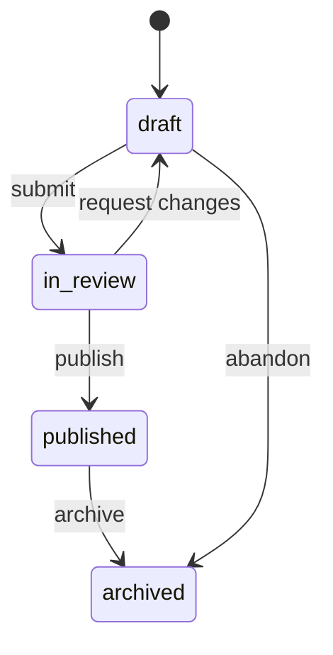
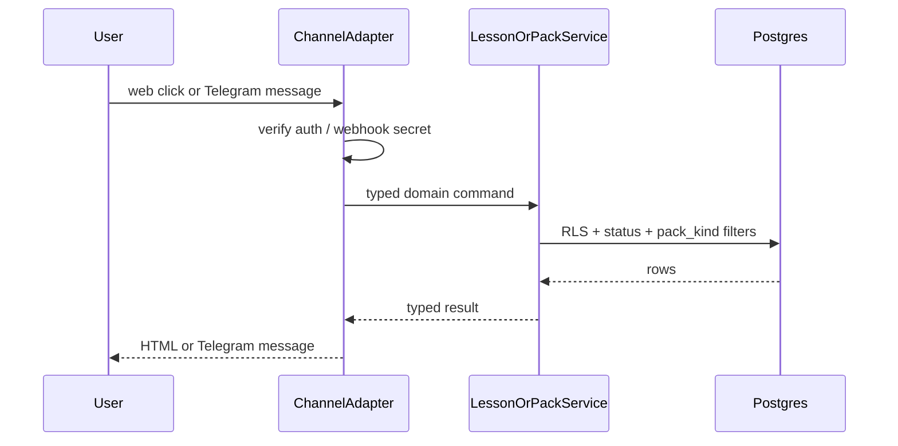

# Request for Comments (RFC) / Tech Spec

**Title:** Channel adapter interface and content-pack confinement
**Date:** 2026-08-16
**Author:** Pollux founding team
**Status:** `Draft`
**Last reconciled:** N/A (not yet reconciled with code)
**PRD Reference:** PRD-F1 (canon desk), PRD-F2 (published pack read), PRD-F3 (self-launch kit), PRD-F5 (Telegram adapter), PRD-F15 (outreach kit dual allowlist); confinement also backs PRD-F10 commit share
**SDD Reference:** [sdd-pollux.md](sdd-pollux.md) sections 2-5 and 8
**RFC ID:** `pollux-rfc-001`
**Research input:** [research-pollux-agent-era-mil.md](research-pollux-agent-era-mil.md)

> **STALE vs PRD 0.5 (2026-08-16):** PRD-F15 campaign kit is now the Must-Have product. F1/F3/F10 are later. Dual allowlist (`canon` vs `outreach_kit`) and "kit never mints official share" still hold. Rollout order that ships canon UI before F15 is inverted for v1: kit surfaces first. Reconcile before code.

---

## 1. Context & Objective

**The problem this solves:**
Pollux must run pack publish and pack read on the web PWA first, then optionally on chat bots, without forking business logic per channel. Crisis answers must never come from an LLM or the open web. Packs need a publish workflow so leaders can draft safely and readers only see approved versions. Official share is a human commit (PRD-F10). Outreach kits (PRD-F15) are a second published allowlist: facilitator material must never become crisis canon and must never mint official share.

**Product thesis (civic capability restriction):**
Pack confinement is not an implementation footnote. It is the civic form of capability restriction: the crisis path has no open-web tool. There are **two live allowlists**, not one published bucket and not RAG:

- **Canon allowlist:** `pack_kind = 'canon'` and `status = 'published'`. Crisis UI and bot fact replies may read only these packs, and only item kinds `fact|route|contact|faq|media`.
- **Outreach-kit allowlist:** `pack_kind = 'outreach_kit'` and `status = 'published'`. Kit catalog, session runner, and print packet may read only these packs, and only item kinds `module|agenda|activity|facilitation_note|handout|source`.

Draft / in_review packs remain **quarantine** (invisible to learners and share tokens). Hard ban: open-web RAG and LLM generation of crisis facts. Kit text is facilitator material, not SK-official crisis canon. Limits are enforced in SQL and the service layer (absence of tools), not as prompt advice a model can be talked out of. Irreversible commit (publish, share-as-official) stays a human principal action. Kit sessions cannot perform that commit.

**Reference in PRD/SDD:**
This RFC implements PRD-F1, PRD-F2, PRD-F3, PRD-F10, and PRD-F15. Channel priority locks Scrutiny G-4 (Telegram first). Pack approval chain (G-6) stays open and is load-bearing; this RFC covers publish confinement, dual allowlists, and version pin only.

**Success criteria:**
- Web PWA is the primary client. Pack read and publish logic lives in shared services, not in UI or bot code.
- Telegram is the first Should-Have adapter behind `ChannelAdapter`. Messenger/WhatsApp stay Could-Have stubs.
- Crisis UI and bot replies for facts resolve only to `content_packs.status = 'published'` AND `pack_kind = 'canon'` at a pinned `version`, with item kinds in `fact|route|contact|faq|media`.
- Kit catalog / run / print resolve only to `status = 'published'` AND `pack_kind = 'outreach_kit'`, with item kinds in `module|agenda|activity|facilitation_note|handout|source`.
- Draft / in_review packs are invisible to readers and to public share tokens.
- Kit items cannot satisfy `GetPackItem` crisis/fact paths. Kit sessions cannot mint `canon_share` tokens.
- No crisis code path can call open-web fetch, RAG, or an LLM for facts (gate, not polite refusal).

---

## 2. Proposed Solution

**Approach:**
Ship **web-first** with a **bot adapter interface**. The domain speaks in typed commands (`StartLesson`, `SubmitAttempt`, `ListPublishedPacks`, `GetPackItem`, `MintShareLink`, `ListPublishedKits`, `GetKit`, `StartKitSession`, `PrintKitPacket`). Each channel translates its transport into those commands and renders the result.

Content packs use a **status state machine**, a **`pack_kind` discriminator**, and **version pinning**. Publish is an explicit action by `admin` (or org-delegated `leader` once pilot policy is set). Share links store `pack_id` + `pack_version` so a later edit does not silently change what was shared. `MintShareLink` / commit share apply to **canon packs only**.





**Architecture changes:**
- Add `lib/channels/types.ts` with `ChannelAdapter` and normalized inbound/outbound message types.
- Add `lib/channels/telegram.ts` implementing the adapter (Should-Have).
- Add pack service methods: `createDraft`, `submitForReview`, `publish`, `getPublished`, `resolveShareToken`.
- Enforce dual-allowlist reads in SQL (`status = 'published'` AND the command's `pack_kind`) and again in the service layer.
- Crisis commands (`ListPublishedPacks`, `GetPackItem`, bot fact replies) never query `outreach_kit` rows.
- Kit commands (`ListPublishedKits`, `GetKit`, `StartKitSession`, `PrintKitPacket`) never query `canon` rows and never mint share tokens.
- Feature-flag bot routes separately from web (`ENABLE_TELEGRAM_ADAPTER`).
- Feature-flag outreach kit (`ENABLE_OUTREACH_KIT`) default **off** until PRD-F15 ships.

---

## 3. Technical Details & Contracts

### Data Model Changes

Pack and share tables are defined in SDD §3. This RFC adds the confinement rules, `pack_kind` (`canon` | `outreach_kit`), and publish transitions (no extra tables required for v1 dual allowlists).

```
-- Publish bumps version and stamps auditor (kind is immutable after create)
UPDATE content_packs
SET status = 'published',
    version = version + 1,
    published_at = now(),
    published_by = :actor_id
WHERE id = :pack_id
  AND status IN ('draft', 'in_review');

-- Crisis / learner / bot fact reads (canon allowlist)
SELECT p.*, i.*
FROM content_packs p
JOIN pack_items i ON i.pack_id = p.id
WHERE p.status = 'published'
  AND p.pack_kind = 'canon'
  AND p.slug = :slug
  AND i.kind IN ('fact', 'route', 'contact', 'faq', 'media');

-- Public kit catalog / GetKit / print packet (outreach_kit allowlist)
SELECT p.*, i.*
FROM content_packs p
JOIN pack_items i ON i.pack_id = p.id
WHERE p.status = 'published'
  AND p.pack_kind = 'outreach_kit'
  AND p.slug = :slug
  AND i.kind IN ('module', 'agenda', 'activity', 'facilitation_note', 'handout', 'source');

-- Share resolve pins version; official share is canon only
SELECT p.*, i.*
FROM share_links s
JOIN content_packs p ON p.id = s.pack_id AND p.version = s.pack_version
JOIN pack_items i ON i.pack_id = p.id
WHERE s.token = :token
  AND p.status = 'published'
  AND p.pack_kind = 'canon'
  AND (s.expires_at IS NULL OR s.expires_at > now());
```

**Hard bans (normative):**

- Kit items **cannot** satisfy `GetPackItem` crisis/fact paths. A published `outreach_kit` row with `status = 'published'` is still invisible to crisis SQL (`pack_kind = 'canon'` required). Matching slug, keyword, or item id from a kit must 404 / refuse on the crisis path.
- A kit session (`StartKitSession` / `PrintKitPacket`) **cannot** mint official share tokens. `MintShareLink` and commit share (`canon_share`) reject `pack_kind = 'outreach_kit'` with 403. No `canon_share` event, no share_links insert.

If a pack is edited after publish, editors work on a new draft row or a draft revision policy decided at implementation. v1 rule: **mutations after publish create a new draft copy or require archive+new pack**; never mutate the published version in place. Prefer immutable published versions (copy-on-write draft). Document the chosen implementation in the first migration PR. `pack_kind` is set at create and does not change on publish.

### API Changes

```
POST /api/channels/telegram/webhook

Headers:
  X-Telegram-Bot-Api-Secret-Token: <TELEGRAM_WEBHOOK_SECRET>

Request: Telegram Update JSON (verified)

Behavior:
  1. Reject if secret mismatch (401)
  2. Dedupe on update_id
  3. Map message/callback to domain command
  4. Call core service
  5. Reply via Bot API sendMessage / editMessageText
  6. Never forward raw user text into pack generation or LLM crisis paths
  7. Fact replies use GetPackItem / pack search with pack_kind = canon only

Response: 200 OK quickly after accept (Telegram retry policy)
```

```
POST /api/leader/packs/:id/publish

Auth: session; role admin (v1). Leader publish deferred until org policy exists.

Request: { }  // empty body; id in path

Response 200:
{
  "id": "uuid",
  "slug": "barangay-flood-routes",
  "status": "published",
  "pack_kind": "canon",
  "version": 2,
  "published_at": "ISO-8601"
}

Response 409: pack not in draft|in_review
Response 403: insufficient role
```

```
GET /api/share/:token

Response 200: { pack meta + items for pinned version; pack_kind is always canon }
Response 404: unknown, expired, pack no longer published, or pack_kind is not canon
```

Kit HTTP surfaces (behind `ENABLE_OUTREACH_KIT`; 404 while flag is off):

```
GET /api/kits                     // ListPublishedKits
GET /api/kits/:slug               // GetKit
POST /api/kits/:slug/sessions     // StartKitSession
GET /api/kits/:slug/packet        // PrintKitPacket
```

Auth: session as for other learner/leader reads; all four queries require `status = 'published'` AND `pack_kind = 'outreach_kit'`. None of these routes call `MintShareLink` or write `share_links`.

### ChannelAdapter contract

```ts
type PackKind = 'canon' | 'outreach_kit';

type DomainCommand =
  | { type: 'start_lesson'; lessonSlug: string; userId: string }
  | { type: 'submit_attempt'; lessonSlug: string; userId: string; answers: Answer[] }
  | { type: 'list_packs'; orgSlug?: string } // canon allowlist
  | { type: 'get_pack'; slug: string } // canon
  | { type: 'get_pack_item'; slug: string; itemId: string } // crisis/fact; canon only
  | { type: 'mint_share_link'; packId: string; userId: string } // canon only; commit share
  | { type: 'list_published_kits'; orgSlug?: string }
  | { type: 'get_kit'; slug: string }
  | { type: 'start_kit_session'; slug: string; userId: string }
  | { type: 'print_kit_packet'; slug: string };

type DomainResult =
  | { type: 'lesson_card'; payload: LessonCard }
  | { type: 'attempt_scored'; payload: ScoreResult }
  | { type: 'pack_list'; payload: PackSummary[] }
  | { type: 'pack_view'; payload: PublishedPack }
  | { type: 'share_minted'; payload: { token: string; url: string } }
  | { type: 'kit_list'; payload: KitSummary[] }
  | { type: 'kit_view'; payload: PublishedKit }
  | { type: 'kit_session'; payload: KitSession }
  | { type: 'kit_packet'; payload: KitPacket }
  | { type: 'error'; code: string; message: string };

interface ChannelAdapter {
  readonly channel: 'web' | 'telegram' | 'messenger' | 'whatsapp';
  parseInbound(raw: unknown): Promise<DomainCommand | null>;
  render(result: DomainResult): Promise<void>;
}
```

Web does not need a full adapter class. Server actions call core services directly. Bots must go through the adapter so transport quirks stay at the edge.

Command-to-allowlist mapping:

| Command | Required `pack_kind` | Allowed item kinds | May mint `canon_share` |
|---------|----------------------|--------------------|------------------------|
| `list_packs`, `get_pack`, `get_pack_item` | `canon` | `fact\|route\|contact\|faq\|media` | no (read only) |
| `mint_share_link` | `canon` | n/a (pack row) | yes, after human commit |
| `list_published_kits`, `get_kit`, `start_kit_session`, `print_kit_packet` | `outreach_kit` | `module\|agenda\|activity\|facilitation_note\|handout\|source` | **never** |

`get_pack_item` on a kit slug or kit item id is an error (`not_found`). `mint_share_link` on an `outreach_kit` pack is an error (`forbidden`). `start_kit_session` has no share-mint side effect.

### State Management

- Pack status transitions are server-only. Client cannot PATCH `status` to `published`.
- Client cannot PATCH `pack_kind`. Kind is chosen at create.
- Lesson attempts store `lesson_version` at submit time.
- Share links pin `pack_version` at mint time and store only canon packs.
- Kit sessions are not official share. They do not write `share_links` or `canon_share`.
- No client-side crisis cache that outlives pack archive without a max-age + revalidate on focus.

### Pack confinement rules (normative)

1. Crisis and MIL factual answers are served only from `pack_items` of a published **canon** pack version (**canon allowlist**: `status = 'published'` AND `pack_kind = 'canon'`, item kinds `fact|route|contact|faq|media`).
2. Open-web fetch, RAG, and LLM generation of crisis facts are forbidden (**hard ban**; absence of capability, not prompt text). The outreach kit is a second SQL allowlist, not RAG and not a crisis source.
3. Optional LLM coach (SDD §8) must not receive pack bodies or user crisis questions.
4. Bot free-text that looks like a crisis question maps to pack search / keyword match over **canon** published items, or a fixed refuse+redirect-to-pack message. Never to a model. Never to `outreach_kit` items.
5. Untrusted user text is delimited and never concatenated into system prompts as instructions.
6. Draft / in_review content is **quarantine**: never pasteable into learner UI, share tokens, kit runner, print packet, or any helper brief.
7. Publish and official share remain human principal actions; no automated agent may flip `status` to `published` or mint an official share without an authenticated leader/admin session.
8. A general web-surfing agent is out of scope for this RFC and for v1 Pollux. Injection pedagogy (PRD-F11) is authored vignette content only.
9. **Kit is not canon.** Published `outreach_kit` items cannot satisfy `GetPackItem` or any crisis/fact path, even when `status = 'published'`.
10. **Kit cannot mint official share.** `MintShareLink` / commit share (`canon_share`) accept canon packs only. `StartKitSession` and `PrintKitPacket` must not insert `share_links` or emit `canon_share`.
11. Outreach kit surfaces stay behind `ENABLE_OUTREACH_KIT` (default off) until PRD-F15 ships. Flag off means kit commands return disabled/404; crisis paths are unchanged.

---

## 4. Alternatives Considered

| Option | Why Rejected |
|--------|-------------|
| Chat-first (Telegram primary, web later) | SK self-launch on a phone favors PWA. Telegram remains Should-Have for pack read/share. |
| Messenger as first bot | Scrutiny G-4 **resolved Telegram first** (2026-07-15). Telegram Bot API is simpler for a user-initiated webhook prototype without Page review friction. Messenger stays Could-Have. |
| Shared mutable pack row (edit in place after publish) | Shared links and learner screens would change underfoot. Harmful for crisis routes. Version pin is required. |
| Open-web RAG for crisis Q&A | Hallucination risk on evacuation facts. Forbidden by IDEA doctrine and Scrutiny FC-5. Puts the guard inside the channel. |
| Prompt-only "do not invent crisis facts" without SQL filter | Advice degrades; injection can contradict instructions. Gate must live outside the model. |
| One published allowlist for both crisis facts and seminar kits | Kit copy would become crisis canon and could mint official share. Dual `pack_kind` allowlists keep civic restriction. |
| Kit session mints the same share token as canon desk | Official share is a human commit over live canon (PRD-F10). Facilitator packets are not SK-official crisis URLs. |
| General web-surfing helper for learners | Imports principal-agent and prompt-injection residual loss. Out of scope; teach via vignette if needed. |
| Per-channel fork of scoring logic | Divergent badges and scores. Adapter + shared rule engine keeps one truth. |

---

## 5. AI / Agent Implementation Notes

*Channel + packs have no required AI. Optional coach is out of scope for this RFC except confinement rules 3 to 5 above.*

**Model used:** N/A for pack/channel core.
**Prompt strategy:** N/A.
**Tool calls in this feature:** None.

**Edge cases if coach is later enabled:**
- User asks "where do I evacuate?" in Telegram. Adapter routes to published **canon** pack keyword match or refuse template. Never to coach. Never to an outreach kit item.
- Injected text in a vignette answer field cannot change pack publish state or system role.
- Facilitator kit text in a session runner cannot be forwarded into crisis fact replies or share mint.

**Token budget for this feature:** $0 (no model on this path).

---

## 6. Security, Privacy & Performance

**Security surface:**
- Telegram webhook requires secret token header match. Ignore updates without it.
- Publish endpoint requires admin session. Audit `published_by`.
- Share tokens are high-entropy (use `crypto.randomBytes(24)` hex/base64url). No sequential IDs.
- Share mint checks `pack_kind = 'canon'` before insert. Kit routes have no mint handler.
- Webhook payloads validated with Zod. Unknown fields stripped.
- `ENABLE_OUTREACH_KIT` default off; kit routes 404 until F15 ships.

**Performance:**
- Webhook handlers acknowledge within 500ms. Heavy work stays in-request only if under budget.
- Pack list queries filter on indexed `(status, pack_kind, org_slug)`.
- Keyword watch list is local org storage only. No Meltwater. No paid social listening.

**Privacy:**
- Telegram user ids stored only after explicit bind. Map to `profiles.id`.
- Youth/PII consent remains CLR (Scrutiny G-2). Do not collect phone numbers in v1 packs.

---

## 7. Execution Plan

**Can this ship behind a feature flag?** Yes. `ENABLE_TELEGRAM_ADAPTER=false` by default. Pack confinement for **canon** ships with web and is not optional. Outreach kit commands ship behind `ENABLE_OUTREACH_KIT=false` until PRD-F15 ships.

**Ticket breakdown** (create once RFC is Approved):

| Ticket | Description | Size |
|--------|-------------|------|
| `POLLUX-CH-01` | Drizzle schema for packs, items, watch_keywords, share_links + RLS; `pack_kind` | M |
| `POLLUX-CH-02` | Pack service: draft → review → publish; dual-allowlist reads; version pin | M |
| `POLLUX-CH-03` | Leader UI: pack editor, publish (admin), share link mint (canon only) | M |
| `POLLUX-CH-04` | `ChannelAdapter` types + web path using core services | S |
| `POLLUX-CH-05` | Telegram webhook adapter behind flag | M |
| `POLLUX-CH-06` | QAD cases: unpublished invisible; share pins version; injection cannot publish; kit cannot feed crisis; kit cannot mint share | S |
| `POLLUX-CH-07` | Outreach kit commands behind `ENABLE_OUTREACH_KIT` (PRD-F15) | M |

**Rollout order:** Schema (`pack_kind`) → pack service + web UI (canon) → share links (canon only) → adapter interface → Telegram flag on staging → QA confinement tests → optional prod Telegram flag → F15 kit flag on staging after QAD dual-allowlist cases pass.

*Tickets feed PRD §9 when the PRD exists. Keep milestone mapping consistent.*

---

## Self-Check

- [x] Section 3 has exact schema DDL / SQL semantics, not vague descriptions
- [x] Crisis SQL includes `pack_kind = 'canon'`; kit SQL includes `pack_kind = 'outreach_kit'`
- [x] Explicit bans: kit items cannot satisfy crisis `GetPackItem`; kit session cannot mint `canon_share`
- [x] Section 3 API changes have request/response shapes
- [x] Telegram webhook secret and flag rules unchanged in spirit
- [x] Section 4 has real rejected alternatives
- [x] Section 5 scoped correctly (AI only for confinement notes)
- [x] Section 7 ticket list is actionable; `ENABLE_OUTREACH_KIT` default off
- [x] No PRD feature laundry list; focuses on channel + pack decisions
- [x] AGENTS hard bans applied (no em-dashes)
