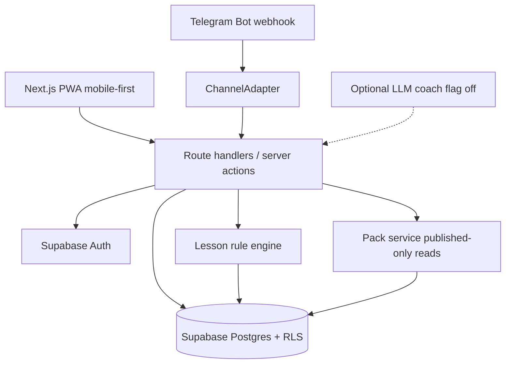

# System Design Document (SDD)

**Project:** Pollux
**Date:** 2026-07-15
**Version:** 0.1
**Owner:** Pollux founding team
**Status:** Draft
**Last reconciled:** N/A (not yet reconciled with code)
**PRD:** [prd-pollux.md](prd-pollux.md) (provisional feature IDs until PRD lands)

> Prerequisite: [idea-pollux.md](idea-pollux.md), [scrutiny-pollux.md](scrutiny-pollux.md). Downstream: [rfc-pollux-channel-packs.md](rfc-pollux-channel-packs.md), [build-pollux.md](build-pollux.md). Scrutiny fixes carried: Hobby vs commercial host (G-3), Telegram first bot adapter (G-4), pack publish workflow (G-6), LLM off critical path.

---

## 1. Architectural Vision & Principles

**Architecture style:** Serverless monolith on Vercel. Next.js App Router (server components, route handlers, server actions). Supabase for Postgres and Auth. Optional Telegram webhook as a thin channel adapter.

**Guiding principles:**
- Server-side first. Roles, pack publish, and scoring run on the server. The client never owns truth.
- Deterministic lesson core. Vignette scoring is a pure rule engine. No LLM on the critical path.
- Channel-agnostic domain. Web PWA is the primary surface. Bots call the same lesson and pack services through a `ChannelAdapter` interface ([rfc-pollux-channel-packs.md](rfc-pollux-channel-packs.md)).
- Pack confinement. Crisis facts come only from published content-pack versions. No open-web RAG.
- Untrusted in, validated out. User text and bot payloads cannot override system instructions or pack content.

**Key trade-offs made:**
- Single Supabase Postgres project for v1. Read replicas are debt past ~1k DAU.
- No job queue for v1. Lesson scoring is sync. Pack publish is a transactional status flip. Optional LLM coaching (flag off) stays request-scoped or waits for a later CR.
- Vercel Hobby only for non-commercial prototypes. Commercial pilots move to Vercel Pro (~$20) or Cloudflare Pages+Workers before paid use (Scrutiny FC-6 / G-3).
- RBAC is three roles (`learner`, `leader`, `admin`), not a full permission matrix.

---

## 2. High-Level Architecture



**Layers:**

| Layer | Technology | Responsibility |
|-------|------------|----------------|
| Client | Next.js App Router, React, PWA shell | Lesson UI, pack viewer, leader admin lite, offline lesson cache |
| API / Gateway | Next.js route handlers + server actions | Authz, Zod validation, role checks, webhook verify |
| Service / Compute | Pure TypeScript modules in `lib/` | Rule engine, pack publish/read, share-link mint, channel adapters |
| Data | Supabase Postgres + Auth | Users/roles, lessons, attempts, packs, watch keywords, share links |
| Infrastructure | Vercel (app) + Supabase (data/auth); Telegram Bot API optional | Hosting; commercial host upgrade when leaving Hobby |

### Traceability to PRD features

Provisional IDs until [prd-pollux.md](prd-pollux.md) locks. Replace with PRD-stable IDs on PRD write.

| PRD feature | Realized by (this SDD) |
|-------------|------------------------|
| PRD-F1 Inoculation game | `lessons`, `vignettes`, `attempts` (§3); rule engine (§2, §4); lesson APIs (§4) |
| PRD-F2 Content packs | `content_packs`, `pack_items` (§3); pack service published-only (§4, §5); RFC pack confinement |
| PRD-F3 Admin lite | Leader routes; `watch_keywords`, `share_links` (§3, §4); publish workflow in RFC |
| PRD-F4 Auth roles | Supabase Auth; `profiles.role` (§3, §5); RLS + server role checks |
| PRD-F5 Telegram adapter (Should) | `ChannelAdapter` + webhook (§4); details in [rfc-pollux-channel-packs.md](rfc-pollux-channel-packs.md) |

---

## 3. Data Architecture

**Primary database:** Supabase Postgres via Drizzle ORM. *Reason: relational lesson/pack graph, RLS for role isolation, free-tier friendly pre-revenue.*
**Secondary / cache:** Browser Cache Storage for offline lesson payloads only. No Redis in v1.
**Vector store:** N/A. No RAG corpus.

### Backend Schema

**Table: `profiles`** (mirrors Supabase `auth.users`)

| Column | Type | Null? | Default | Key / Index | Constraint |
|--------|------|-------|---------|-------------|------------|
| `id` | UUID | No | | PK, FK → `auth.users.id` | ON DELETE CASCADE |
| `display_name` | TEXT | Yes | | | |
| `role` | TEXT | No | `'learner'` | idx | CHECK IN (`learner`, `leader`, `admin`) |
| `org_slug` | TEXT | Yes | | idx | pilot org / barangay tag; nullable until GTM pilot named |
| `created_at` | TIMESTAMPTZ | No | now() | | |

**Table: `lessons`**

| Column | Type | Null? | Default | Key / Index | Constraint |
|--------|------|-------|---------|-------------|------------|
| `id` | UUID | No | gen_random_uuid() | PK | |
| `slug` | TEXT | No | | UNIQUE | |
| `title` | TEXT | No | | | |
| `technique` | TEXT | No | | idx | e.g. emotion_appeal, false_expert, digital_manipulation |
| `status` | TEXT | No | `'draft'` | | CHECK IN (`draft`, `published`, `archived`) |
| `version` | INT | No | 1 | | increments on publish |
| `created_at` | TIMESTAMPTZ | No | now() | | |

**Table: `vignettes`**

| Column | Type | Null? | Default | Key / Index | Constraint |
|--------|------|-------|---------|-------------|------------|
| `id` | UUID | No | gen_random_uuid() | PK | |
| `lesson_id` | UUID | No | | FK → `lessons.id`, idx | ON DELETE CASCADE |
| `sort_order` | INT | No | 0 | | |
| `body` | TEXT | No | | | vignette text shown to learner |
| `is_manipulative` | BOOLEAN | No | | | ground truth for scoring |
| `technique_tag` | TEXT | No | | | must match parent lesson technique or `true_news` |
| `explanation` | TEXT | No | | | shown after choice |
| `is_calibration` | BOOLEAN | No | false | | true-news calibration vignettes |

**Table: `attempts`**

| Column | Type | Null? | Default | Key / Index | Constraint |
|--------|------|-------|---------|-------------|------------|
| `id` | UUID | No | gen_random_uuid() | PK | |
| `user_id` | UUID | No | | FK → `profiles.id`, idx | ON DELETE CASCADE |
| `lesson_id` | UUID | No | | FK → `lessons.id`, idx | ON DELETE CASCADE |
| `lesson_version` | INT | No | | | snapshot of lesson.version at attempt |
| `score` | INT | No | 0 | | correct count |
| `max_score` | INT | No | | | vignette count |
| `badge_earned` | TEXT | Yes | | | null if incomplete / below threshold |
| `answers` | JSONB | No | `'[]'` | | array of `{vignette_id, choice, correct}` |
| `completed_at` | TIMESTAMPTZ | Yes | | | null while in progress |
| `created_at` | TIMESTAMPTZ | No | now() | | |

**Table: `content_packs`**

| Column | Type | Null? | Default | Key / Index | Constraint |
|--------|------|-------|---------|-------------|------------|
| `id` | UUID | No | gen_random_uuid() | PK | |
| `slug` | TEXT | No | | UNIQUE | |
| `title` | TEXT | No | | | |
| `locale` | TEXT | No | `'en-PH'` | | |
| `status` | TEXT | No | `'draft'` | idx | CHECK IN (`draft`, `in_review`, `published`, `archived`) |
| `version` | INT | No | 1 | | bump on each publish |
| `org_slug` | TEXT | Yes | | idx | scopes pack to pilot org |
| `published_at` | TIMESTAMPTZ | Yes | | | set on publish |
| `published_by` | UUID | Yes | | FK → `profiles.id` | leader or admin |
| `created_at` | TIMESTAMPTZ | No | now() | | |

**Table: `pack_items`**

| Column | Type | Null? | Default | Key / Index | Constraint |
|--------|------|-------|---------|-------------|------------|
| `id` | UUID | No | gen_random_uuid() | PK | |
| `pack_id` | UUID | No | | FK → `content_packs.id`, idx | ON DELETE CASCADE |
| `sort_order` | INT | No | 0 | | |
| `kind` | TEXT | No | | | CHECK IN (`fact`, `route`, `contact`, `faq`, `media`) |
| `title` | TEXT | No | | | |
| `body` | TEXT | No | | | curated text only |
| `source_label` | TEXT | Yes | | | human-readable provenance |
| `source_url` | TEXT | Yes | | | optional official URL; not fetched at answer time |

**Table: `watch_keywords`**

| Column | Type | Null? | Default | Key / Index | Constraint |
|--------|------|-------|---------|-------------|------------|
| `id` | UUID | No | gen_random_uuid() | PK | |
| `org_slug` | TEXT | No | | idx | |
| `keyword` | TEXT | No | | | |
| `created_by` | UUID | No | | FK → `profiles.id` | |
| `created_at` | TIMESTAMPTZ | No | now() | | UNIQUE (`org_slug`, lower(`keyword`)) |

**Table: `share_links`**

| Column | Type | Null? | Default | Key / Index | Constraint |
|--------|------|-------|---------|-------------|------------|
| `id` | UUID | No | gen_random_uuid() | PK | |
| `token` | TEXT | No | | UNIQUE | opaque public token |
| `pack_id` | UUID | No | | FK → `content_packs.id`, idx | ON DELETE CASCADE |
| `pack_version` | INT | No | | | pins shared version |
| `created_by` | UUID | No | | FK → `profiles.id` | |
| `expires_at` | TIMESTAMPTZ | Yes | | | null = no expiry for v1 pilots |
| `created_at` | TIMESTAMPTZ | No | now() | | |

**Key relationships:**
- Profile 1:N Attempts; Lesson 1:N Vignettes; Lesson 1:N Attempts
- ContentPack 1:N PackItems; ContentPack 1:N ShareLinks
- Profile (leader) creates WatchKeywords and ShareLinks scoped by `org_slug`

**Indexes & performance:** `(user_id, lesson_id, created_at)` on attempts for history; `(status, org_slug)` on content_packs for leader lists; unique token on share_links for public resolve.

**Migration strategy:** Drizzle migrations, forward-only. Each migration stays backward-compatible for one release so a Vercel redeploy rollback does not require a data restore.

**Planning sketch (not schema source of truth):**

```
Profile(role) → Attempt → Lesson → Vignette
Leader → ContentPack(status machine) → PackItem
Leader → WatchKeyword | ShareLink(token → pack@version)
ChannelAdapter → same Attempt / Pack read APIs
```

**Caching strategy:** Service worker caches published lesson JSON for offline play. Pack reads are live from Postgres (crisis packs must stay current). No CDN edge cache of pack bodies in v1 without explicit TTL + purge on publish.

---

## 4. API Design & External Integrations

**API style:** REST route handlers for webhooks and public share resolve; server actions for authenticated UI mutations.

**Internal endpoints (high-level):**

| Method | Path | Purpose |
|--------|------|---------|
| GET | `/api/lessons` | List published lessons |
| GET | `/api/lessons/:slug` | Lesson + vignettes (no ground-truth flags to client before submit) |
| POST | `/api/lessons/:slug/attempts` | Submit answers; server scores via rule engine; returns score + explanations |
| GET | `/api/packs` | List published packs for caller org / public pilot set |
| GET | `/api/packs/:slug` | Published pack + items only |
| POST | `/api/leader/packs` | Create draft pack (leader/admin) |
| PATCH | `/api/leader/packs/:id` | Edit draft / submit for review |
| POST | `/api/leader/packs/:id/publish` | Publish (admin or delegated leader per org policy) |
| POST | `/api/leader/watch-keywords` | Upsert keyword watch list |
| POST | `/api/leader/share-links` | Mint share link for published pack@version |
| GET | `/api/share/:token` | Resolve public share (published pack snapshot) |
| POST | `/api/channels/telegram/webhook` | Telegram updates → ChannelAdapter |

**External integrations:**

| Service | Purpose | Rate limits / fallback |
|---------|---------|------------------------|
| Supabase Auth | Magic link / OAuth; session cookies via `@supabase/ssr` | Auth outage → hard fail with clear UI; no anonymous lesson write |
| Supabase Postgres | Primary store + RLS | Connection errors → 503; no silent empty packs |
| Telegram Bot API | Optional Should-Have adapter | Verify secret token; 429 → retry with backoff; drop duplicate `update_id` |
| Optional LLM provider (flag `ENABLE_LLM_COACH=false`) | Coaching after lesson only | Disabled by default; if on, timeout → skip coach, keep rule score |

---

## 5. Security & Authorization

**Authentication:** Supabase Auth. Email magic link plus optional OAuth. Telegram identity mapped to a linked `profiles` row after user-initiated `/start` bind (no cold outreach).
**Session management:** Supabase session in httpOnly cookies via `@supabase/ssr`. Server refreshes on request.
**Authorization model:** RBAC with three roles.
- `learner`: play lessons, read published packs, own attempts
- `leader`: learner rights + draft packs for `org_slug`, watch keywords, share links
- `admin`: publish/archive any pack, manage roles

Enforced with Postgres RLS and an explicit server role check before mutations. Client-supplied `role` or `user_id` is ignored.

**Data protection:**
- PII at rest: Supabase managed encryption; minimize fields (no national ID in v1). Youth/consent gates live in CLR (Scrutiny G-2).
- Secrets: env only (`SUPABASE_SERVICE_ROLE_KEY`, `TELEGRAM_BOT_TOKEN`, `TELEGRAM_WEBHOOK_SECRET`). Service role never ships to the client.
- Input validation: Zod on every route and webhook payload. Max lengths on free text. Strip null bytes.

**Pack read rule:** Learners and public share links receive rows only where `content_packs.status = 'published'`. Draft and in_review never leave the leader/admin API.

---

## 6. Infrastructure, CI/CD & Deployment

**Hosting:**
- Pre-revenue / non-commercial prototype: Vercel Hobby + Supabase free
- Commercial pilot: Vercel Pro or Cloudflare Pages + Workers (choose before first paid invoice; Scrutiny G-3)

**Environments:**
- `dev`: local Next.js + Supabase local or dedicated dev project
- `staging`: Vercel preview per PR
- `prod`: Vercel production + Supabase prod (Hobby only while non-commercial)

**CI/CD:** GitHub Actions: lint → typecheck → test → preview deploy. Production on tagged release.

**Backup & disaster recovery:**
- Backup cadence: Supabase daily automated backups (plan retention)
- **RTO:** 8h · **RPO:** 24h for v1 pilot
- Restore tested: run a restore drill against staging before first public pilot; record date in OPS

---

## 7. Non-Functional Requirements

| Requirement | Target | Notes |
|-------------|--------|-------|
| API response (p95), lesson score | < 300ms | rule engine only |
| Pack list / resolve (p95) | < 400ms | published reads |
| Telegram webhook ack | < 500ms | enqueue work only if needed; ack fast |
| Optional LLM coach TTFT | < 2s | flag off by default; never blocks score |
| Uptime | 99% pilot | raise in OPS for paid B2G |
| Max concurrent users v1 | 100 | SK / barangay pilot scale |
| Data retention | attempts retained until account delete; packs versioned indefinitely | CLR finalizes youth retention |

---

## 8. AI / Agent Architecture

Optional coaching only. Critical path is the rule engine. Feature flag `ENABLE_LLM_COACH` defaults to `false`.

**AI approach:** Post-lesson coach. Summarizes which techniques the learner missed using attempt JSON and fixed technique blurbs. Never answers crisis questions. Never reads unpublished packs.

**Model selection:**

| Agent / Task | Model | Reason |
|-------------|-------|--------|
| Post-lesson coach (optional) | Pin at enable time (e.g. a small/fast Anthropic or OpenAI model) | Cheap coaching; exact id verified in BUILD §3 before enable |

**Context architecture:**
- System prompt: fixed privileged instructions. States that user text is untrusted and crisis facts are out of scope.
- User payload: delimited attempt summary + technique labels only. No pack bodies. No raw webhook dumps.
- Max context: keep under ~4k tokens per call.
- Prompt caching: cache static system prefix when the provider supports it.

**Tool surface:** None in v1. Coach cannot call tools, browse the web, or query packs.

**HITL gates:**
- Enabling the flag in prod requires an admin env change and AIA sign-off.
- Pack publish remains human-only. No model-assisted auto-publish in v1.

**Token / cost budget:**

| Operation | Est. tokens | Est. cost | Monthly budget assumption |
|-----------|-------------|-----------|--------------------------|
| Coach after lesson | ~2-4k | pin provider pricing at enable | $0 while flag off; soft cap 500 calls/mo if on |

**Fallback behavior:** On provider error or timeout, omit coach copy. Lesson score and explanations still return from the rule engine.

### 8.1 AI Safety & Threat Surface

| Risk (OWASP LLM) | Applies? | Control in this system | Eval (QAD ref) |
|------------------|----------|------------------------|----------------|
| LLM01 Prompt injection | Y if coach on | User text delimited; system prompt privileged; no tools; coach never receives pack or crisis prompts | QAD AI-01 (when AIA/QAD land) |
| LLM02 Insecure output handling | Y if coach on | Output treated as display text; escaped in UI; never executed | QAD AI-02 |
| LLM06 Sensitive-info disclosure | Y if coach on | No PII beyond display name in prompt; no secrets; minimize attempt payload | QAD AI-03 |
| LLM07 Excessive agency | N (no tools) | No tool surface | n/a |
| Jailbreak / guardrail bypass | Y if coach on | Refuse crisis/factual asks; no silent retry past refusal | QAD AI-04 |
| Hallucination causing user harm | Y (crisis) | Coach forbidden from crisis Q&A; crisis UI only serves published packs | QAD AI-05 / pack confinement tests |

**Data sent to model providers:**
- What leaves our boundary: attempt summary + technique labels when flag on; nothing when off
- Provider retention / training terms: record in CLR §1 sub-processors before enable
- Region / residency: none pinned for v1 prototype; revisit for LGU pilots

**Trust boundary note:** Anything a learner, leader, or bot user can type is untrusted. It may request coaching tone changes. It must never command system behavior, pack content, or tool calls. Crisis answers come only from published `pack_items`.

---

## Self-Check

- [x] Section 2 has an actual diagram, not just a description
- [x] Section 3 defines every table with typed columns, keys, and constraints
- [x] Section 3 has a migration strategy that keeps rollback safe
- [x] Every external integration in Section 4 has a rate-limit / fallback strategy
- [x] Section 7 latency targets are specific numbers
- [x] Section 8 filled for optional LLM; AIA required before enabling the flag
- [x] Section 8.1: applicable OWASP-LLM risks have controls; provider terms deferred to CLR on enable
- [x] Known v1 shortcuts documented as tech debt in Section 1
- [x] Document answers *how* to build; product *what* stays in PRD
- [x] AGENTS hard bans applied (no em-dashes)
