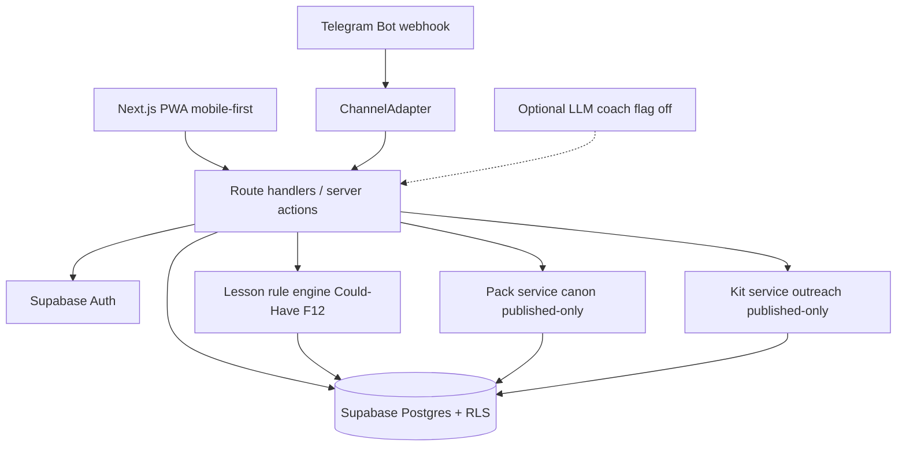
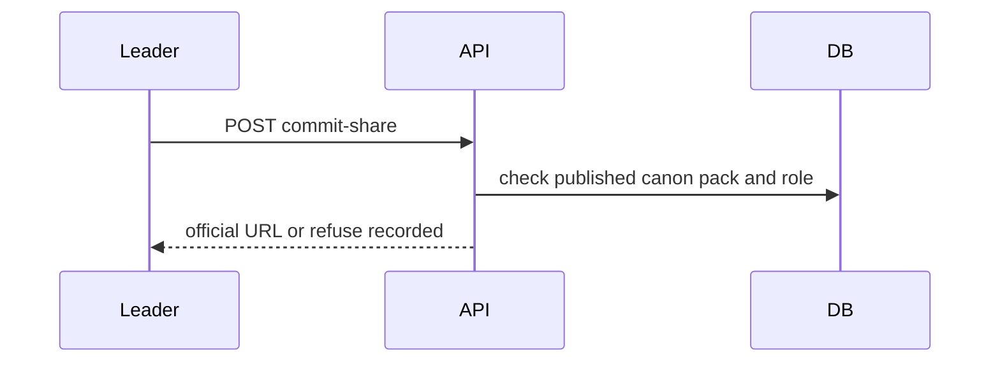

# System Design Document (SDD)

**Project:** Pollux
**Date:** 2026-08-16
**Version:** 0.2
**Owner:** Pollux founding team
**Status:** Draft
**Last reconciled:** N/A (not yet reconciled with code)
**PRD:** [prd-pollux.md](prd-pollux.md) (provisional feature IDs until PRD lands)

> Prerequisite: [idea-pollux.md](idea-pollux.md), [scrutiny-pollux.md](scrutiny-pollux.md). Downstream: [rfc-pollux-channel-packs.md](rfc-pollux-channel-packs.md), [build-pollux.md](build-pollux.md). Scrutiny fixes carried: commercial host **Cloudflare** (G-3), Telegram first bot (G-4), LLM **post-MVP** (G-5), pack publish workflow still open (G-6).

---

## 1. Architectural Vision & Principles

**Architecture style:** Serverless monolith (Next.js App Router: server components, route handlers, server actions). Supabase for Postgres and Auth. Deploy prototype on Vercel Hobby or Cloudflare Pages; **commercial pilots on Cloudflare Pages/Workers**. Optional Telegram webhook as a thin channel adapter (after MVP core).

**Guiding principles:**
- Server-side first. Roles, pack publish, and scoring run on the server. The client never owns truth.
- Deterministic lesson core. Vignette scoring is a pure rule engine. No LLM on the critical path.
- Channel-agnostic domain. Web PWA is the primary surface. Bots call the same lesson and pack services through a `ChannelAdapter` interface ([rfc-pollux-channel-packs.md](rfc-pollux-channel-packs.md)).
- Pack confinement. Crisis facts come only from published content-pack versions. No open-web RAG.
- Untrusted in, validated out. User text and bot payloads cannot override system instructions or pack content.

**Key trade-offs made:**
- Single Supabase Postgres project for v1. Read replicas are debt past ~1k DAU.
- No job queue for v1. Lesson scoring is sync. Pack publish is a transactional status flip. Optional LLM coaching (flag off) stays request-scoped or waits for a later CR.
- Vercel Hobby only for non-commercial prototypes. Commercial pilots move to **Cloudflare Pages+Workers** before paid use (Scrutiny FC-6 / G-3 locked). Vercel Pro is the alternate.
- RBAC is three roles (`reader`, `leader`, `admin`), not a full permission matrix. Older drafts said `learner`; treat that as `reader`.

---

## 2. High-Level Architecture



**Layers:**

| Layer | Technology | Responsibility |
|-------|------------|----------------|
| Client | Next.js App Router, React, PWA shell | Lesson UI (F12 Could-Have), canon pack viewer, outreach kit runner/print, leader admin lite, offline lesson cache |
| API / Gateway | Next.js route handlers + server actions | Authz, Zod validation, role checks, webhook verify, `ENABLE_OUTREACH_KIT` gate |
| Service / Compute | Pure TypeScript modules in `lib/` | Pack service (canon crisis/commit-share), kit service beside pack service (not the rule engine), share-link mint, channel adapters; F12 rule engine stays lesson-only |
| Data | Supabase Postgres + Auth | Users/roles, packs + `pack_kind`, pack items, `kit_sessions`, watch keywords, share links; F12 `lessons` / `vignettes` / `attempts` retained as Could-Have |
| Infrastructure | Cloudflare Pages/Workers (commercial) or Vercel Hobby (proto) + Supabase (data/auth); Telegram Bot API after MVP | Hosting; G-3 Cloudflare when monetizing |

### Traceability to PRD features

Provisional IDs until [prd-pollux.md](prd-pollux.md) locks. Replace with PRD-stable IDs on PRD write.

| PRD feature | Realized by (this SDD) |
|-------------|------------------------|
| PRD-F1 Canon desk + templates | `content_packs`, `pack_items`, org space, template clone (§3, §4); publish workflow in RFC |
| PRD-F2 Content packs (published-only read) | `content_packs`, `pack_items` (§3); pack service published-only (§4, §5); RFC pack confinement |
| PRD-F3 SK self-launch kit | Launch checklist, paper card, leader routes; `share_links` (§3, §4) |
| PRD-F4 Auth roles | Supabase Auth; `profiles.role` (§3, §5); RLS + server role checks |
| PRD-F10 Human commit share (Must-Have) | Official share mint only after authenticated leader commit; events `canon_share` / `canon_refuse`; no agent publish (RFC rule 7) |
| PRD-F5 Telegram adapter (Should) | `ChannelAdapter` + webhook (§4); details in [rfc-pollux-channel-packs.md](rfc-pollux-channel-packs.md) |
| PRD-F12 Inoculation drill (Could-Have) | `lessons`, `vignettes`, `attempts` (§3); rule engine (§2, §4); not required to launch; **not** the PRD-F15 kit path |
| PRD-F15 Outreach / seminar kit | `content_packs.pack_kind = outreach_kit`, kit-only `pack_items.kind` values, `kit_sessions` (§3); `ListPublishedKits`, `GetKit`, `StartKitSession`, `PrintKitPacket` (§4); flag `ENABLE_OUTREACH_KIT`; crisis/commit-share stay on canon packs only |

---

## 3. Data Architecture

**Primary database:** Supabase Postgres via Drizzle ORM. *Reason: relational pack/kit graph plus optional F12 lesson graph, RLS for role isolation, free-tier friendly pre-revenue.*
**Secondary / cache:** Browser Cache Storage for offline F12 lesson payloads only. No Redis in v1. Outreach kits are not scored lessons; do not store kit runs as attempts.
**Vector store:** N/A. No RAG corpus.

### Backend Schema

**Table: `profiles`** (mirrors Supabase `auth.users`)

| Column | Type | Null? | Default | Key / Index | Constraint |
|--------|------|-------|---------|-------------|------------|
| `id` | UUID | No | | PK, FK → `auth.users.id` | ON DELETE CASCADE |
| `display_name` | TEXT | Yes | | | |
| `role` | TEXT | No | `'learner'` | idx | CHECK IN (`learner`, `leader`, `admin`) |
| `org_slug` | TEXT | Yes | | idx | pilot org / barangay tag; nullable until GTM pilot named |
| `created_at` | TIMESTAMPTZ | No | now() | | |

**Table: `lessons`** (PRD-F12 Could-Have inoculation drill. Not the PRD-F15 kit path. Do not reuse for outreach kits.)

| Column | Type | Null? | Default | Key / Index | Constraint |
|--------|------|-------|---------|-------------|------------|
| `id` | UUID | No | gen_random_uuid() | PK | |
| `slug` | TEXT | No | | UNIQUE | |
| `title` | TEXT | No | | | |
| `technique` | TEXT | No | | idx | e.g. emotion_appeal, false_expert, digital_manipulation |
| `status` | TEXT | No | `'draft'` | | CHECK IN (`draft`, `published`, `archived`) |
| `version` | INT | No | 1 | | increments on publish |
| `created_at` | TIMESTAMPTZ | No | now() | | |

**Table: `vignettes`** (PRD-F12 Could-Have. Not the kit path.)

| Column | Type | Null? | Default | Key / Index | Constraint |
|--------|------|-------|---------|-------------|------------|
| `id` | UUID | No | gen_random_uuid() | PK | |
| `lesson_id` | UUID | No | | FK → `lessons.id`, idx | ON DELETE CASCADE |
| `sort_order` | INT | No | 0 | | |
| `body` | TEXT | No | | | vignette text shown to learner |
| `is_manipulative` | BOOLEAN | No | | | ground truth for scoring |
| `technique_tag` | TEXT | No | | | must match parent lesson technique or `true_news` |
| `explanation` | TEXT | No | | | shown after choice |
| `is_calibration` | BOOLEAN | No | false | | true-news calibration vignettes |

**Table: `attempts`** (PRD-F12 Could-Have. Kit runs use `kit_sessions`, not attempts. No score columns on kit sessions.)

| Column | Type | Null? | Default | Key / Index | Constraint |
|--------|------|-------|---------|-------------|------------|
| `id` | UUID | No | gen_random_uuid() | PK | |
| `user_id` | UUID | No | | FK → `profiles.id`, idx | ON DELETE CASCADE |
| `lesson_id` | UUID | No | | FK → `lessons.id`, idx | ON DELETE CASCADE |
| `lesson_version` | INT | No | | | snapshot of lesson.version at attempt |
| `score` | INT | No | 0 | | correct count |
| `max_score` | INT | No | | | vignette count |
| `badge_earned` | TEXT | Yes | | | null if incomplete / below threshold |
| `answers` | JSONB | No | `'[]'` | | array of `{vignette_id, choice, correct}` |
| `completed_at` | TIMESTAMPTZ | Yes | | | null while in progress |
| `created_at` | TIMESTAMPTZ | No | now() | | |

**Table: `content_packs`**

| Column | Type | Null? | Default | Key / Index | Constraint |
|--------|------|-------|---------|-------------|------------|
| `id` | UUID | No | gen_random_uuid() | PK | |
| `slug` | TEXT | No | | UNIQUE | |
| `title` | TEXT | No | | | |
| `pack_kind` | TEXT | No | `'canon'` | idx | CHECK IN (`canon`, `outreach_kit`) |
| `locale` | TEXT | No | `'en-PH'` | | |
| `status` | TEXT | No | `'draft'` | idx | CHECK IN (`draft`, `in_review`, `published`, `archived`) |
| `version` | INT | No | 1 | | bump on each publish |
| `org_slug` | TEXT | Yes | | idx | scopes pack to pilot org |
| `published_at` | TIMESTAMPTZ | Yes | | | set on publish |
| `published_by` | UUID | Yes | | FK → `profiles.id` | leader or admin |
| `created_at` | TIMESTAMPTZ | No | now() | | |

**`pack_kind` query split (mandatory):**
- Crisis desk, commit-share, and public canon share resolve query **only** `pack_kind = 'canon'`.
- Kit list, get, session start, and print query **only** `pack_kind = 'outreach_kit'`.
- Crisis answers are never taken from `outreach_kit` items.

**Table: `pack_items`**

| Column | Type | Null? | Default | Key / Index | Constraint |
|--------|------|-------|---------|-------------|------------|
| `id` | UUID | No | gen_random_uuid() | PK | |
| `pack_id` | UUID | No | | FK → `content_packs.id`, idx | ON DELETE CASCADE |
| `sort_order` | INT | No | 0 | | |
| `kind` | TEXT | No | | | dual allowlist; see below |
| `title` | TEXT | No | | | |
| `body` | TEXT | No | | | curated text only |
| `source_label` | TEXT | Yes | | | human-readable provenance |
| `source_url` | TEXT | Yes | | | optional official URL; not fetched at answer time |

**Dual `kind` allowlist (canon vs outreach_kit):**

| Parent `pack_kind` | Allowed `pack_items.kind` | Used by |
|--------------------|---------------------------|---------|
| `canon` | `fact`, `route`, `contact`, `faq`, `media` | Crisis Q&A, commit-share. These kinds are **canon-only**. |
| `outreach_kit` | `module`, `agenda`, `activity`, `facilitation_note`, `handout`, `source` | Kit read / run / print. These kinds are **kit-only**. |

**SQL intent:** Union CHECK on `kind` IN (all ten values). Composite enforcement: BEFORE INSERT/UPDATE trigger on `pack_items` that loads parent `content_packs.pack_kind` and rejects mismatches (Postgres CHECK cannot reference another table). Optional extra CHECK if `pack_kind` is ever denormalized onto the item row.

**Service gate:** Pack write APIs and kit write APIs reject a mismatched `kind` even if the trigger is missing. Canon pack service never returns kit kinds. Kit service never returns canon kinds. Crisis/commit-share code paths must filter `pack_kind = 'canon'` so outreach items cannot leak into crisis answers.

**Table: `kit_sessions`** (PRD-F15. Not a lesson attempt. No score / max_score / badge / answers columns.)

| Column | Type | Null? | Default | Key / Index | Constraint |
|--------|------|-------|---------|-------------|------------|
| `id` | UUID | No | gen_random_uuid() | PK | |
| `org_slug` | TEXT | No | | idx | |
| `pack_id` | UUID | No | | FK → `content_packs.id`, idx | ON DELETE RESTRICT; parent must be `pack_kind = 'outreach_kit'` |
| `pack_version` | INT | No | | | snapshot of `content_packs.version` at start |
| `started_by` | UUID | No | | FK → `profiles.id`, idx | |
| `audience_band` | TEXT | No | | | facilitator-declared audience band |
| `format` | TEXT | No | | | e.g. `barangay_45m`, `camp_halfday` |
| `started_at` | TIMESTAMPTZ | No | now() | | |
| `ended_at` | TIMESTAMPTZ | Yes | | | null while in progress |

**Table: `watch_keywords`**

| Column | Type | Null? | Default | Key / Index | Constraint |
|--------|------|-------|---------|-------------|------------|
| `id` | UUID | No | gen_random_uuid() | PK | |
| `org_slug` | TEXT | No | | idx | |
| `keyword` | TEXT | No | | | |
| `created_by` | UUID | No | | FK → `profiles.id` | |
| `created_at` | TIMESTAMPTZ | No | now() | | UNIQUE (`org_slug`, lower(`keyword`)) |

**Table: `share_links`**

| Column | Type | Null? | Default | Key / Index | Constraint |
|--------|------|-------|---------|-------------|------------|
| `id` | UUID | No | gen_random_uuid() | PK | |
| `token` | TEXT | No | | UNIQUE | opaque public token |
| `pack_id` | UUID | No | | FK → `content_packs.id`, idx | ON DELETE CASCADE |
| `pack_version` | INT | No | | | pins shared version |
| `created_by` | UUID | No | | FK → `profiles.id` | |
| `expires_at` | TIMESTAMPTZ | Yes | | | null = no expiry for v1 pilots |
| `created_at` | TIMESTAMPTZ | No | now() | | |

Share mint and resolve attach only to `pack_kind = 'canon'` published versions. Outreach kits are not shared through `share_links`.

**Key relationships:**
- Profile 1:N Attempts; Lesson 1:N Vignettes; Lesson 1:N Attempts (F12 Could-Have only)
- ContentPack 1:N PackItems; ContentPack 1:N ShareLinks (canon share); ContentPack (`outreach_kit`) 1:N KitSessions
- Profile (leader) creates WatchKeywords, ShareLinks, and KitSessions scoped by `org_slug`
- Kit sessions do not point at lessons, vignettes, or attempts

**Indexes & performance:** `(user_id, lesson_id, created_at)` on attempts for F12 history; `(status, pack_kind, org_slug)` on content_packs for canon vs kit lists; unique token on share_links for public resolve; `(org_slug, started_at)` on kit_sessions.

**Migration strategy:** Drizzle migrations, forward-only. Each migration stays backward-compatible for one release so a Vercel redeploy rollback does not require a data restore. Add `pack_kind` with default `'canon'` so existing rows stay crisis/canon packs.

**Planning sketch (not schema source of truth):**

```
Profile(role) → Attempt → Lesson → Vignette          # F12 Could-Have; not F15
Leader → ContentPack(pack_kind=canon, status) → PackItem(kind in fact|route|contact|faq|media)
Leader → ContentPack(pack_kind=outreach_kit, status) → PackItem(kind in module|agenda|activity|facilitation_note|handout|source)
Leader → KitSession(pack@version, format, audience_band)   # no score
Leader → WatchKeyword | ShareLink(token → canon pack@version)
ChannelAdapter → same Pack read APIs (canon); kit APIs are web/leader first
```

**Caching strategy:** Service worker caches published F12 lesson JSON for offline play. Canon pack reads are live from Postgres (crisis packs must stay current). Kit packet print may snapshot the pinned `pack_version` for a session; do not serve kit bodies on the crisis path. No CDN edge cache of pack bodies in v1 without explicit TTL + purge on publish.

---

## 4. API Design & External Integrations

**API style:** REST route handlers for webhooks and public share resolve; server actions for authenticated UI mutations.

**Internal endpoints (high-level):**

| Method | Path | Purpose |
|--------|------|---------|
| GET | `/api/lessons` | List published lessons |
| GET | `/api/lessons/:slug` | Lesson + vignettes (no ground-truth flags to client before submit) |
| POST | `/api/lessons/:slug/attempts` | Submit answers; server scores via rule engine; returns score + explanations |
| GET | `/api/packs` | List published **canon** packs (`pack_kind = 'canon'`) for caller org / public pilot set. Never lists outreach kits. |
| GET | `/api/packs/:slug` | Published canon pack + items only. Crisis answers use this path; never `outreach_kit`. |
| POST | `/api/leader/packs` | Create draft pack (leader/admin); body includes `pack_kind` (`canon` default) |
| PATCH | `/api/leader/packs/:id` | Edit draft / submit for review; kind vs `pack_kind` service gate |
| POST | `/api/leader/packs/:id/publish` | Publish (admin or delegated leader per org policy) |
| GET | `/api/kits` | **ListPublishedKits** (flag on): published `outreach_kit` only |
| GET | `/api/kits/:slug` | **GetKit**: published outreach kit + kit-kind items |
| POST | `/api/kits/:slug/sessions` | **StartKitSession**: pin pack version; no scoring |
| GET | `/api/kits/:slug/print` | **PrintKitPacket**: printable markdown now; HTML later |
| POST | `/api/leader/watch-keywords` | Upsert keyword watch list |
| POST | `/api/leader/share-links` | Mint share link for published **canon** pack@version (must follow commit; never outreach_kit) |
| POST | `/api/leader/commit-share` | PRD-F10: `canon_share` or `canon_refuse`; official token only on share |
| GET | `/api/share/:token` | Resolve public share (published **canon** pack snapshot only) |
| POST | `/api/channels/telegram/webhook` | Telegram updates → ChannelAdapter |



**PRD-F15 kit APIs** (feature flag `ENABLE_OUTREACH_KIT`; default off. If flag is not `true`, all four return 404. Kits with `status != 'published'` are invisible to participants. Do not call the lesson rule engine.)

**ListPublishedKits**

- Method / path: `GET /api/kits`
- Request: query `org_slug?`, `locale?`. No body. Identity from session cookies if present; public pilot list may be org-scoped without a learner role.
- Server filter: `status = 'published'` AND `pack_kind = 'outreach_kit'`.
- Response `200`: `{ "kits": [ { "slug": "barangay-seminar", "title": "...", "locale": "en-PH", "version": 1, "published_at": "..." } ] }`
- Errors: `404` flag off; `503` DB.

**GetKit**

- Method / path: `GET /api/kits/:slug`
- Request: path `slug`. No ground-truth lesson fields (kits are not vignettes).
- Server filter: published outreach kit only; items whose `kind` is in the kit allowlist.
- Response `200`: `{ "slug": "...", "title": "...", "locale": "...", "version": 1, "items": [ { "id": "<uuid>", "kind": "module"|"agenda"|"activity"|"facilitation_note"|"handout"|"source", "sort_order": 0, "title": "...", "body": "...", "source_label": null, "source_url": null } ] }`
- Errors: `404` flag off, unpublished, wrong `pack_kind`, or unknown slug.

**StartKitSession**

- Method / path: `POST /api/kits/:slug/sessions`
- Auth: `leader` or `admin` (server role check). Ignore client `user_id`.
- Request body (Zod): `{ "audience_band": "<string>", "format": "<string>" }` where `format` examples include `barangay_45m` and `camp_halfday`.
- Server: load published `outreach_kit` by slug; insert `kit_sessions` with `pack_id`, `pack_version` snapshot, `org_slug` from session profile, `started_by` from session, `started_at` now, `ended_at` null. No score fields.
- Response `201`: `{ "id": "<uuid>", "pack_id": "<uuid>", "pack_version": 1, "org_slug": "...", "audience_band": "...", "format": "...", "started_at": "...", "ended_at": null }`
- Errors: `401` / `403`; `404` flag off or kit not published; `422` Zod.

**PrintKitPacket**

- Method / path: `GET /api/kits/:slug/print`
- Request: query `session_id?` (optional; when present, pin print to that session's `pack_version`). Identity: leader/admin for facilitation packets; participants may print only published kit public fields if product allows later.
- Server filter: published `outreach_kit` only. Assemble items in `sort_order`. Never mix in canon `fact`/`route`/`contact`/`faq`/`media` rows. Never use this response as a crisis answer source.
- Response `200` contract (v1 markdown; HTML later without changing the envelope): `{ "pack_slug": "...", "pack_version": 1, "content_type": "text/markdown", "body": "# ..." }` where `content_type` is `text/markdown` now and may be `text/html` when HTML print ships.
- Errors: `404` flag off, unpublished, or wrong kind; `422` if `session_id` does not match slug/version.

**External integrations:**

| Service | Purpose | Rate limits / fallback |
|---------|---------|------------------------|
| Supabase Auth | Magic link / OAuth; session cookies via `@supabase/ssr` | Auth outage → hard fail with clear UI; no anonymous lesson write |
| Supabase Postgres | Primary store + RLS | Connection errors → 503; no silent empty packs |
| Telegram Bot API | Optional Should-Have adapter | Verify secret token; 429 → retry with backoff; drop duplicate `update_id` |
| Optional LLM provider (flag `ENABLE_LLM_COACH=false`) | Coaching after F12 lesson only | Disabled by default; if on, timeout → skip coach, keep rule score; never answers crisis; never reads outreach kits as crisis facts |
| Outreach kit (flag `ENABLE_OUTREACH_KIT=false`) | List/get/session/print for `pack_kind = outreach_kit` | Default off; flag off → 404 on kit routes; still never query kits for crisis or commit-share |

---

## 5. Security & Authorization

**Authentication:** Supabase Auth. Email magic link plus optional OAuth. Telegram identity mapped to a linked `profiles` row after user-initiated `/start` bind (no cold outreach).
**Session management:** Supabase session in httpOnly cookies via `@supabase/ssr`. Server refreshes on request.
**Authorization model:** RBAC with three roles.
- `learner`: play F12 lessons (if enabled), read published **canon** packs, own attempts; no unpublished kits
- `leader`: learner rights + draft packs for `org_slug`, watch keywords, share links, start kit sessions, print kit packets when `ENABLE_OUTREACH_KIT` is on
- `admin`: publish/archive any pack, manage roles

Enforced with Postgres RLS and an explicit server role check before mutations. Client-supplied `role` or `user_id` is ignored.

**Data protection:**
- PII at rest: Supabase managed encryption; minimize fields (no national ID in v1). Youth/consent gates live in CLR (Scrutiny G-2).
- Secrets: env only (`SUPABASE_SERVICE_ROLE_KEY`, `TELEGRAM_BOT_TOKEN`, `TELEGRAM_WEBHOOK_SECRET`). Service role never ships to the client. Feature flags `ENABLE_LLM_COACH` and `ENABLE_OUTREACH_KIT` are env, not secrets.
- Input validation: Zod on every route and webhook payload. Max lengths on free text. Strip null bytes.

**Pack read rule:** Learners and public share links receive rows only where `content_packs.status = 'published'` **and** `pack_kind = 'canon'`. Draft and in_review never leave the leader/admin API. Crisis Q&A and commit-share never read `outreach_kit` rows or kit-only item kinds.

**Kit read rule:** Participant kit APIs receive rows only where `content_packs.status = 'published'` **and** `pack_kind = 'outreach_kit'`. Unpublished kits are invisible. Kit item kinds only. `StartKitSession` / `PrintKitPacket` use the kit service, not the lesson rule engine and not `attempts`.

---

## 6. Infrastructure, CI/CD & Deployment

**Hosting:**
- Pre-revenue / non-commercial prototype: Vercel Hobby or Cloudflare free tier + Supabase free
- Commercial pilot: **Cloudflare Pages + Workers** before first paid invoice (Scrutiny G-3); Vercel Pro alternate

**Environments:**
- `dev`: local Next.js + Supabase local or dedicated dev project
- `staging`: preview deploy per PR (Cloudflare or Vercel)
- `prod`: Cloudflare production (or Vercel Pro if chosen) + Supabase prod (Hobby only while non-commercial)

**CI/CD:** GitHub Actions: lint → typecheck → test → preview deploy. Production on tagged release.

**Backup & disaster recovery:**
- Backup cadence: Supabase daily automated backups (plan retention)
- **RTO:** 8h · **RPO:** 24h for v1 pilot
- Restore tested: run a restore drill against staging before first public pilot; record date in OPS

---

## 7. Non-Functional Requirements

| Requirement | Target | Notes |
|-------------|--------|-------|
| API response (p95), lesson score | < 300ms | rule engine only |
| Pack list / resolve (p95) | < 400ms | published reads |
| Telegram webhook ack | < 500ms | enqueue work only if needed; ack fast |
| Optional LLM coach TTFT | < 2s | flag off by default; never blocks score |
| Uptime | 99% pilot | raise in OPS for paid B2G |
| Max concurrent users v1 | 100 | SK / barangay pilot scale |
| Data retention | attempts retained until account delete; packs versioned indefinitely | CLR finalizes youth retention |

---

## 8. AI / Agent Architecture

Optional coaching only. Critical path is the rule engine. Feature flag `ENABLE_LLM_COACH` defaults to `false`.

**AI approach:** Post-lesson coach. Summarizes which techniques the learner missed using attempt JSON and fixed technique blurbs. Never answers crisis questions. Never reads unpublished packs.

**Model selection:**

| Agent / Task | Model | Reason |
|-------------|-------|--------|
| Post-lesson coach (optional) | Pin at enable time (e.g. a small/fast Anthropic or OpenAI model) | Cheap coaching; exact id verified in BUILD §3 before enable |

**Context architecture:**
- System prompt: fixed privileged instructions. States that user text is untrusted and crisis facts are out of scope.
- User payload: delimited attempt summary + technique labels only. No pack bodies. No raw webhook dumps.
- Max context: keep under ~4k tokens per call.
- Prompt caching: cache static system prefix when the provider supports it.

**Tool surface:** None in v1. Coach cannot call tools, browse the web, or query packs.

**HITL gates:**
- Enabling the flag in prod requires an admin env change and AIA sign-off.
- Pack publish remains human-only. No model-assisted auto-publish in v1.

**Token / cost budget:**

| Operation | Est. tokens | Est. cost | Monthly budget assumption |
|-----------|-------------|-----------|--------------------------|
| Coach after lesson | ~2-4k | pin provider pricing at enable | $0 while flag off; soft cap 500 calls/mo if on |

**Fallback behavior:** On provider error or timeout, omit coach copy. Lesson score and explanations still return from the rule engine.

### 8.1 AI Safety & Threat Surface

| Risk (OWASP LLM) | Applies? | Control in this system | Eval (QAD ref) |
|------------------|----------|------------------------|----------------|
| LLM01 Prompt injection | Y if coach on | User text delimited; system prompt privileged; no tools; coach never receives pack or crisis prompts | QAD AI-01 (when AIA/QAD land) |
| LLM02 Insecure output handling | Y if coach on | Output treated as display text; escaped in UI; never executed | QAD AI-02 |
| LLM06 Sensitive-info disclosure | Y if coach on | No PII beyond display name in prompt; no secrets; minimize attempt payload | QAD AI-03 |
| LLM07 Excessive agency | N (no tools) | No tool surface | n/a |
| Jailbreak / guardrail bypass | Y if coach on | Refuse crisis/factual asks; no silent retry past refusal | QAD AI-04 |
| Hallucination causing user harm | Y (crisis) | Coach forbidden from crisis Q&A; crisis UI only serves published packs | QAD AI-05 / pack confinement tests |

**Data sent to model providers:**
- What leaves our boundary: attempt summary + technique labels when flag on; nothing when off
- Provider retention / training terms: record in CLR §1 sub-processors before enable
- Region / residency: none pinned for v1 prototype; revisit for LGU pilots

**Trust boundary note:** Anything a learner, leader, or bot user can type is untrusted. It may request coaching tone changes. It must never command system behavior, pack content, or tool calls. Crisis answers come only from published `pack_items`.

---

## Self-Check

- [x] Section 2 has an actual diagram, not just a description
- [x] Section 3 defines every table with typed columns, keys, and constraints
- [x] Section 3 has a migration strategy that keeps rollback safe
- [x] Every external integration in Section 4 has a rate-limit / fallback strategy
- [x] Section 7 latency targets are specific numbers
- [x] Section 8 filled for optional LLM; AIA required before enabling the flag
- [x] Section 8.1: applicable OWASP-LLM risks have controls; provider terms deferred to CLR on enable
- [x] Known v1 shortcuts documented as tech debt in Section 1
- [x] Document answers *how* to build; product *what* stays in PRD
- [x] AGENTS hard bans applied (no em-dashes)
